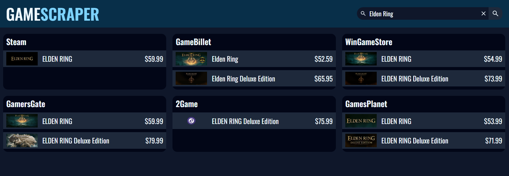

<h1 align="center">GameScraper (v 2.0)</h1>
<h6 align="center">https://gamescraper.ddns.net/    (ctrl+click to open in new tab)</h6>

Search and compare the prices of video games across 6 different online digital platforms.

When you click on a game, it will open a new tab and direct you to the page for that specific game.

<h2>Features</h2>
<ul>
  <li>Reverse proxy that load balances requests across multiple web servers.</li>
  <li>Web servers that query the database to return results that best match what the user searched for.</li>
  <li>Web scraper that collects relevant data for all video games on each website once a day.</li>
  <li>Everything is containerized using Docker, spun up using Docker-Compose, and runs on an AWS EC2 instance.</li>
  <li>MySQL database with ~250,000 total rows/games (updated daily).</li>
  <li>The database is hosted on an AWS RDS instance.</li>
</ul>

<h2>Dependencies</h2>
<h3>Frontend</h3>
<ul>
  <li>Vite</li>
  <li>React</li>
  <li>React-Router</li>
  <li>React-Tooltip</li>
</ul>
<h3>Backend (Web Servers)</h3>
<ul>
  <li>Node</li>
  <li>Express</li>
  <li>Sequelize (MySQL ORM)</li>
  <li>Helmet (basic express app security)</li>
  <li>MySql2</li>
</ul>
<h3>Web Scraper</h3>
<ul>
  <li>Cheerio</li>
  <li>Nodemailer</li>
  <li>Node + Express</li>
  <li>Sequelize + MySql2</li>
</ul>
<h3>Web Scraper</h3>
<ul>
  <li>HAProxy (Docker Image)</li>
</ul>
 

<h2>Limitiations</h2>
<ul>
  <li>GameScraper works best when searching for games by their specific title. An example would be searching for "Grand Theft Auto V" instead of "GTA 5". </li>
  <li>Some games don't show up because their title includes a 'special' character. An example would be "Dark Souls 2" or "Dark Souls II" not showing up in the Steam section because Steam has a "TM" character in between (Dark Souls™️ II)</li>
</ul>

Please check under 'Upcoming Fixes' to see what's being done to resolve these issues.

 

<h2>Issues</h2>
<ul>
  <li>When running on the EC2 instance, the web scraper fails to connect to one of the websites (WinGameStore). Using curl fails as well.</li>
  <li>Some game titles fail to be scraped from the 2game site.</li>
</ul>

Please check under 'Upcoming Fixes' to see what's being done to resolve these issues.

 

<h2>Upcoming Updates and Fixes</h2>
<ul>
  <li>Rework the web scraping code to remove specific special characters, such as ™️. This would improve the returned search results.</li>
  <li>Remove the inclusion of DLCs/Addons when scraping Steam. This would remove much of the 'clutter' that can come up.</li>
  <li>Host code that scrapes WinGameStore, as well as updates the database, somewhere else.</li>
  <li>Switch to scraping with Puppeteer for 2Game to potentially resolve the missing games issue.</li>
  <li>Add a "highlight" for the cheapest option</li>
</ul>

